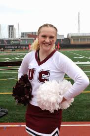

# hw01

# Biography
### Heather Weller
My name is **Heather Weller** and I am a 3rd year Public Policy Major and Human Rights Minor. Here are a few facts about me:
1. I love [narwhals](https://en.wikipedia.org/wiki/Narwhal)
2. I have started two non-profits named:
*Thank a Veteran
*Open Access
3. I am originally from a very small town in Minnesota called New York Mills
4. I will be doing the 5-year BA/MA Program at Harris next year!
5. I am in UC Cheer at UChicago (along with many other RSO's)  
That's all for now, except for a picture of me that you will find below!

