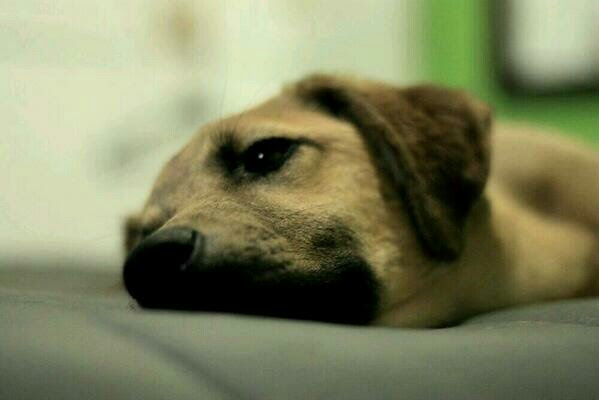

# hw01
## Maria Benavides Bio
***
I was born in Bogota, Colombia. I consider myself a policy professional with international experience in social development, specifically in **childhood development and education**. I am skilled at decomposing, analyzing, and evaluating policy issues to devise possible solutions; for instance, I built new quality measurement tools for early childhood education services in Colombia, which the Ministry of National Education later piloted and adopted in 300 municipalities.

I have cultivated a new interest in the intersection between conflict and childhood development; looking for professional opportunities that allow me to apply her social policy expertise within violent and conflict contexts. Here you can find my [LinkedIn profile](www.linkedin.com/in/maria-benavides-c)

Now, on a more *personal level*, I am the younger of three, I have two brothers. I miss my familiy very much, especially under the current circumstances. I love dogs. Back in Colombia I had the cutest mix breed dog, her name is Pepper. My parents are taking care of her at the moment. Here is a picture of her lovely sweet face. 

During this quarantine time, I have been trying to adjust by having a routine. Some of the activities I try to do daily are: 
* Exercising (yoga and Zumba are my favorites).
* Cooking healthy foods (although I'm not a great cooker)
* Readings and assignments
* Some Switch breaks (the only game I can play is Smash)
* Organizing (it helps keeping me sane)
