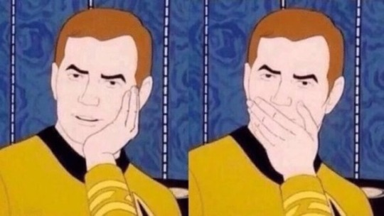

# hw01
# **Story of My Life**

I am Wei, a psychology graduate student trying to learn how to use R. I am from Changsha, a southern city in China that always rains in the spring and summer time. I do environment-related research here in the University of Chicago. [Here is a link to my lab website ](http://enl.uchicago.edu/) where you can learn more about my projects.

A list of things I am doing during the quarantine:
- Learning how to play ukulele
- Learning how to cook sophisticated dishes
- Binge watching old films
- Also binge watching Star Trek: TOS

Above is a brief biography about me. I thought about adding my photo here, but that would be no fun, so I put a **Star Trek** meme template here instead. Maybe it will be useful to my readers. Who knows?
