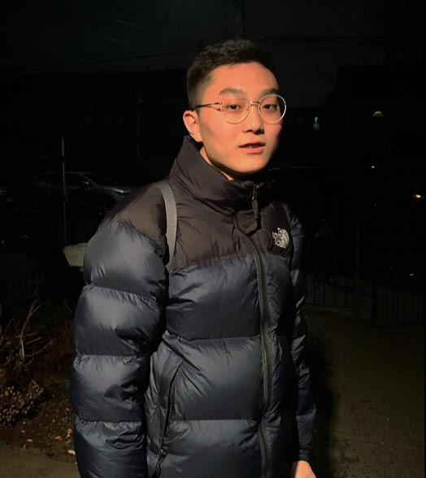

# hw01

## A Short Bio

 

Hi! My name is *Kevin Song* and I'm currently a second-year at the College. I grew up in New York City and went to school in Brooklyn. I plan to study both **Computer Science** and **Sociology** and hope to do research in computational social science. On campus, I am involved with UChicago TechTeam, a civic technology service group part of the IOP, and have a part-time job at TechBar. I love kimchi-fried rice, the *Sherlock* and *Elementary* series, and reasonably priced skincare.

Some fun facts about me...
* I am semi-related to a kpop star
* Julianne Moore once gave me a hug somewhere in Manhattan
* While living abroad, I made friends with many local shiba inus.

I have recently gotten into programming as both an academic interest and creative hobby, here is a Python project where I tried to draw pixelated versions of my favorite characters: https://github.com/ksong814/Pixels (run main.py, I hope it works on your machine) 

