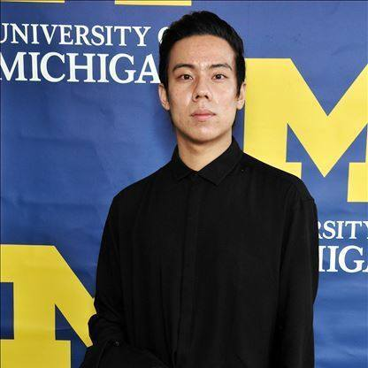

# hw01
library(markdown)
library(knitr)

## Introduction

My name is **Boseong Yun** and please feel free to call me **Peter**! I am a first-year grdaute student studying public policy at the Harris School of Public Policy. I am studying to quantify gender inequalites in text, image, sound, and other kinds of unstructured data. Yes, I have a very long way to go. I have also started my own [Youtube channel](https://www.youtube.com/channel/UCfv5YsyMCcQPNyT-g0cEYGA) which might be more boring than our new quarantine lives. I will try. Please do not hesitate to talk to me if you have any questions and it is really nice to meet you all! 
  
## Introduction through lists
me <- list(name = c("Boseong Yun"),
             major = "Public Policy",
             language = c("Korean", "English"),
             SSN = c(1223328, "No, this is just a joke"))

print(me)
