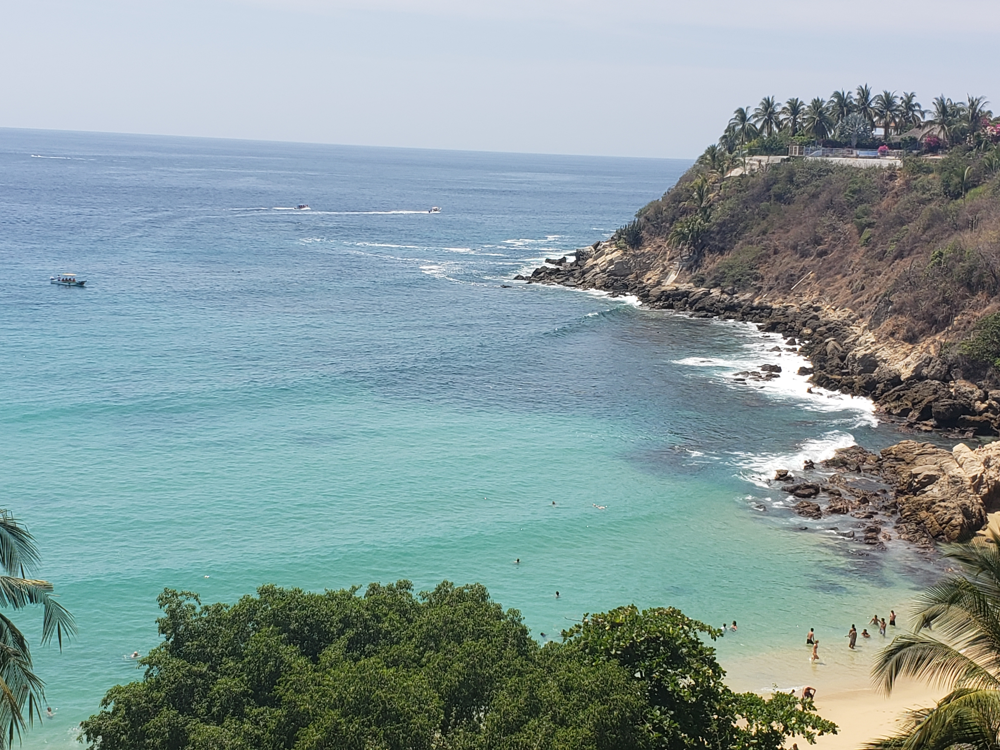

# hw01

## **About Me**

My name is Berenice Martinez and I am a third-year at the College studying Public Policy and Sociology. I grew up in the southwest side of Chicago in a neighborhood called Ashburn. I attended Jones College Prep for high school in the Loop. 

Growing up, I always wanted to become a lawyer. My passion started at a young age with the show Criminal Minds. I loved seeing how lawyers were able to utilize the law to defend their clients and seek justice. My passion was then spurred on by my mother who explained to me why she wanted to become a lawyer growing up and the amazing things she wanted to do. However, she could not achieve her dreams because she had to stop going to school in order to provide for her family. 

Seeking better opportunities, my mom and dad both immigrated to the United States from Durango, Mexico. They are incredibly supportive of me and have always instilled many of their values of perseverance onto me. I hope to one day become a lawyer, specifically an immigration lawyer and assist immigrants in their cases the same way that attorneys helped my parents with theirs. 

I also have 2 older brothers, one who is 22 years old and another who is 30 years old. My 22-year-old brother goes to UIC and my extended family often confuse our schools. They think that UIC is the same college as UChicago. I always have to tell them that they are not the same, which can be frustrating sometimes, but eventually they come to understand that they are different.

I also have some hobbies that I like to do during my free time. These include the following:

* *Watch Netflix*
* *Watch YouTube Videos*
  * *Links to my current YouTube obssessions: [Cute Puppy Video](https://www.youtube.com/watch?v=fBYvHHT8fdE) and [Silly Dog Video](https://www.youtube.com/watch?v=Dsr7sm3A4ew)*  
* *Play Loteria or other board games with my family*
* *Apply to things (like jobs and programs)*
* *Zoom call my friends* 

### **Fun Facts**
Last quarter I studied abroad before the pandemic unfolded in the U.S. I studied in Oaxaca, Mexico where I got to enjoy the warm weather and long night walks. I learned a lot about Mexico's history and the socio-historical processes that allowed Mexico to develop into the nation that we know today. This experience made me feel closer to my parents in a way that provided an in depth understanding of the historical-economic policies and developments that led to their migration. 
Additionally, I love to swim, so I made sure that I got the chance to visit one of the beaches in Oaxaca. Here is a picture of one of the beautiful beaches in Puerto Escondido, Oaxaca. 

I also like to dance. In high school I was involved in an Asian American dancing club where I learned how to dance with traditional Chinese ribbons. I was also in a dance class where I did ballet and contemporary dance. I extended this passion through an organization at UChicago called OLAS where I was able to get in touch with my cultural roots and learned to dance bachata, cumbia, folklorico, and merengue.

 

